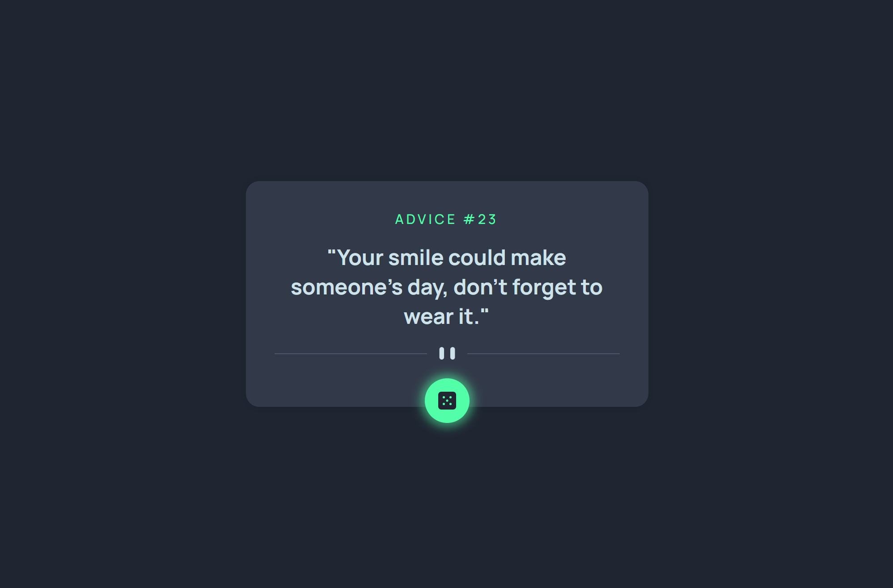

# Frontend Mentor - Advice generator app solution

This is a solution to the [Advice generator app challenge on Frontend Mentor](https://www.frontendmentor.io/challenges/advice-generator-app-QdUG-13db). Frontend Mentor challenges help you improve your coding skills by building realistic projects.

## Table of contents

- [Overview](#overview)
  - [The challenge](#the-challenge)
  - [Screenshot](#screenshot)
  - [Links](#links)
- [My process](#my-process)
  - [Built with](#built-with)
  - [What I learned](#what-i-learned)
  - [Useful resources](#useful-resources)
- [Author](#author)

## Overview

I build this solution with HTML, CSS, and Vanilla JavaScript, this was a good challenge because I use and learn about API, Fetch and async/await functions. 


### The challenge

I be able to:
<ul>
    <li>View the optimal layout for the app depending on their device's screen size</li>
    <li>See hover states for all interactive elements on the page</li>
    <li>Generate a new piece of advice by clicking the dice icon</li>
</ul>


### Screenshot




### Links

- Solution URL: [https://github.com/Kevin-Cay/advice-generator.git](https://github.com/Kevin-Cay/advice-generator.git)
- Live Site URL: [https://upbeat-agnesi-d73201.netlify.app/](https://upbeat-agnesi-d73201.netlify.app/)

## My process

First build the HTML page, then I added styles with CSS and finally I connect the APi with a JavaScript File, using async/await and fetch.

### Built with

- Semantic HTML5 markup
- CSS custom properties
- Flexbox
- CSS Grid
- Mobile-first workflow


### What I learned

Use this section to recap over some of your major learnings while working through this project. Writing these out and providing code samples of areas you want to highlight is a great way to reinforce your own knowledge.

To see how you can add code snippets, see below:

```html
<h1>Some HTML code I'm proud of</h1>

```
```css
.dice {
    position: absolute;
    width: 50px;
    height: 50px;
    bottom: -25;
    left: 50%;
    margin-left: -25px;
    background-color: var(--button-color);
    border-radius: 50%;
    display: flex;
    align-items: center;
    justify-content: center;
}
```
```js
async function callAdvice() {
    try {
        let response = await fetch('https://api.adviceslip.com/advice')
        let data = await response.json()
        await setAdvice(data)
    } catch (error) {
        console.log(error)
    }

}
```


### Useful resources

- [W3schools.com](https://www.w3schools.com/howto/howto_css_loader.asp) - This helped me for the loader 
- [mozilla](https://developer.mozilla.org/es/docs/Web/API/Fetch_API/Using_Fetch) - This is an amazing article which helped me finally understand fundaments of Fetch.


## Author

- Website - [Kevin Cay](https://portfolio-kevin-cay.vercel.app/)
- Frontend Mentor - [@Kevin-Cay](https://www.frontendmentor.io/profile/Kevin-Cay)
- Linkedin - [Kevin Cay](https://www.linkedin.com/in/kevin-cay/)


